# Page Topology - Audley Travel US Homepage

This document outlines the visual structure and sequence of elements on the homepage, along with their key components, layouts, and responsiveness.

## Layout Hierarchy

The body class list is: `gray__style template-home market-us country-none super-region-none tier-none`

```mermaid
graph TD
  Body[body] --> Header[header.hdr]
  Body --> Main[main#content]
  Body --> Footer[footer.ftr.brand-footer]
  
  Header --> BrandBar[div.hdr__brand]
  Header --> HeaderContent[div.hdr__content]
  HeaderContent --> Nav[nav.hdr__nav]
  
  Main --> Section1[1. Brand Video Hero]
  Main --> Section2[2. Brand Preamble Text]
  Main --> Section3[3. Brand Destinations Tabbed]
  Main --> Section4[4. Brand Breaking Line]
  Main --> Section5[5. Brand Journey Block]
  Main --> Section6[6. Brand Carousel Block]
  Main --> Section7[7. Brand Client Feedback Testimonial]
  Main --> Section8[8. Brand CTA]
  Main --> Section9[9. Brand Brochure Request]
  Main --> Section10[10. Brand Why Us]
  
  Footer --> Newsletter[div.brand-footer-newsletter]
  Footer --> Menu[div.brand-footer-menu]
  Footer --> Social[div.brand-footer-social]
  Footer --> Awards[div.brand-footer-awards]
  Footer --> Company[div.brand-footer-company]
```

The overall viewport layout consists of a sticky/fixed Header, flow Content within the `<main>` tag, and a standard Footer.

---

## 1. Header (`header.hdr`)
- **Type:** Fixed/sticky at the top.
- **Children:**
  - `div.hdr__brand` (contains the logo, menu trigger, favorites and phone links).
  - `div.hdr__content` (contains market/location selector, favorites, MyAudley, phone numbers, and "Request a Quote" CTA).
  - `nav.hdr__nav` (contains the main navigation links: Destinations, Ways to Travel, Inspiration, About Us).
- **Behavior:** Responsively switches from stacked desktop navigation to a simplified mobile header with a burger menu.

---

## 2. Main Flow (`main#content`)

### Section 1: Brand Video Hero (`section.brand-video-hero`)
- **Layout:** Full screen or large block.
- **Heading:** `<h1>` - "Find out where you're meant to be."
- **Visuals:** Hero video background or fallback image, overlay title, search input or destination selector.

### Section 2: Brand Preamble Text (`section.brand-preamble-text`)
- **Layout:** Centered block.
- **Heading:** `<h2>` - "We create extraordinary travel moments"
- **Content:** Paragraph detailing Audley Travel's philosophy of meaningful, custom travel.

### Section 3: Brand Destinations Tabbed (`section.brand-destinations-tabbed`)
- **Layout:** Tab-based grid layout.
- **Heading:** `<h2>` - "Where are you waiting to discover?"
- **Content:** Tab buttons with destinations (e.g. Japan, Egypt, Italy, South Africa). Selecting a tab updates the featured destinations with custom images, short descriptions, and "I want to explore" buttons.

### Section 4: Brand Breaking Line (`section.brand-breaking-line`)
- **Layout:** Thin divider separator between sections.

### Section 5: Brand Journey Block (`section.brand-journey-block`)
- **Layout:** Multi-step horizontal block.
- **Heading:** `<h2>` - "Journeys that feel like they were waiting"
- **Content:** Three pillars of the Audley Travel journey:
  1. "We take time to understand you"
  2. "We create your individual trip for you"
  3. "We’re there for you while you travel"

### Section 6: Brand Carousel Block (`section.brand-carousel-block`)
- **Layout:** Carousel of custom itinerary options.
- **Heading:** `<h2>` - "Possibilities, not packages"
- **Content:** Carousel showing trip idea cards:
  - "Cruising the Rhine NEW: vineyards & villages"
  - "Netherlands & Belgium: AmaWaterways river cruise"
  - "Southern Italy & Amalfi Coast"
  - "Highlights of New Zealand self-drive tour"
  - "Luxury Thailand"
  - "Highlights of Australia: city, Outback & reef"
  - "Panoramic Switzerland & Italy"
  - Interactive "View this idea" buttons and Swiper-like navigation controls.

### Section 7: Brand Testimonials (`section.brand-client-feedback-testimonial`)
- **Layout:** Testimonial quotation slider.
- **Heading:** `<h2>` - "Moments we’ve created"
- **Content:** Testimonial quotes from real travelers detailing their personal experiences in different destinations.

### Section 8: Brand CTA (`section.brand-cta`)
- **Layout:** Image banner background with content card.
- **Heading:** `<h2>` - "Find out where you’re meant to be."
- **Content:** Call options: `1-866-547-4745` or `1-866-520-8491` and a main "START YOUR JOURNEY" primary CTA button.

### Section 9: Brand Brochure Request (`section.brand-brochure-request`)
- **Layout:** Two-column split (media + content).
- **Heading:** `<h2>` - "Request our brochure"
- **Content:** Image/media showcase of the brochure and a primary CTA "REQUEST A BROCHURE" button.

### Section 10: Brand Why Us (`section.brand-why-us`)
- **Layout:** 4-column feature list.
- **Heading:** `<h2>` - "Why journey with us?"
- **Sub-headings (4 pillars):**
  - "A trip as individual as you"
  - "A dedicated expert, from start to finish"
  - "Meaningful experiences, real connections"
  - "The travel experts you can trust"

---

## 3. Footer (`footer.ftr.brand-footer`)
- **Children:**
  - `div.brand-footer-newsletter` (input form with "Subscribe" CTA).
  - `div.brand-footer-menu` (multi-column accordion / desktop list for categories: Website, Resources, Company, Destinations).
  - `div.brand-footer-social` (social media icons for Facebook, Instagram, YouTube, LinkedIn).
  - `div.brand-footer-awards` (images for trust badges: BBB, USTOA, IATA, Adventure Travel).
  - `div.brand-footer-company` (copyright text, legal conditions).
